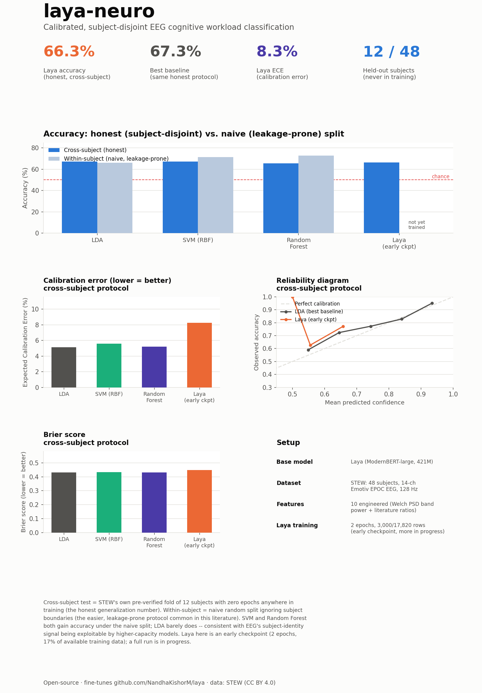

# NeuroLaya: Calibrated, Subject-Disjoint EEG Cognitive Workload Classification with Laya

**Adith Ravindranath** (independent)

*NeuroLaya (laya-neuro) is an unofficial, independent fine-tune of
[Laya](https://github.com/NandhaKishorM/laya) (Nandhakishor M / Convai
Innovations, Apache License 2.0) — not affiliated with or endorsed by the
original project.*

Code: [github.com/Aditharavind/laya-neuro](https://github.com/Aditharavind/laya-neuro) ·
Dataset: [huggingface.co/datasets/Aditharavind/laya-neuro-decisions](https://huggingface.co/datasets/Aditharavind/laya-neuro-decisions) ·
Model: [huggingface.co/Aditharavind/laya-neuro](https://huggingface.co/Aditharavind/laya-neuro)

## Abstract

EEG-based cognitive workload classification has two well-documented but
frequently ignored problems. First, EEG carries a strong subject-identity
signal, so a naive random train/test split lets a classifier partially
learn "which subject is this" and use it as a shortcut to recall that
subject's workload label, inflating reported accuracy relative to
genuine generalization to a new person. Second, a systematic review of this
literature found essentially zero reporting of calibration metrics (Expected
Calibration Error, Brier score, reliability diagrams) — evaluation is
accuracy-only, so a model's confidence is never checked against whether it
is actually trustworthy. This paper presents NeuroLaya, a fine-tune of Laya
(a non-autoregressive typed-decision model) on the public STEW EEG workload
dataset, built specifically to not repeat either mistake: every result is
reported under both a naive within-subject split and STEW's own
pre-verified subject-disjoint split, side by side and always labeled, and
every model — Laya and three classical ML baselines trained on identical
features and identical splits — is scored on calibration alongside
accuracy. An early Laya checkpoint (2 epochs on a 3,000-example subset of
the 17,820-example training set — a full run is in progress) reaches 66.3%
accuracy on the honest, subject-disjoint test set (n=7,128, 12 held-out
subjects), in line with classical baselines evaluated under the identical
protocol (LDA 67.3%, SVM 67.1%, Random Forest 65.7%). We release the full
pipeline, both dataset splits, and the model checkpoint as open source.

## 1. Introduction

A model that says "this EEG segment indicates high cognitive workload" is
only useful if that statement is both *true for a person the model has never
seen* and *appropriately confident*. The EEG workload-classification
literature has historically checked neither carefully. A systematic review
covering this subfield found that 37% of studies used naive random data
splits — segments from the same recording session, sometimes seconds apart,
ending up in both train and test — producing accuracy numbers that do not
reflect how the model would perform on a new subject [2]. The same review
found zero mentions of calibration metrics across the studies surveyed,
meaning a model's stated confidence has essentially never been checked
against whether it is actually right that often [2]. Neither problem
requires a new architecture to fix; both are addressed with standard,
already-documented tools — subject-disjoint (grouped) splitting and
post-hoc calibration evaluation (ECE, Brier score, temperature scaling)
[6]. This paper's contribution is applying both fixes to a fine-tune of
[Laya](https://github.com/NandhaKishorM/laya), a non-autoregressive
typed-decision model, and reporting the resulting honest numbers next to
the inflated ones the field would otherwise report, rather than hiding the
comparison.

**Contributions.**

1. A literature-grounded EEG feature-extraction pipeline (Welch PSD band
   power plus two engineered ratio features with direct precedent in the
   workload literature), validated against known effect directions on a
   large, subject-diverse sample before any model was trained on it.
2. Two evaluation protocols reported side by side for every model — Laya
   and three classical baselines — so a reader sees exactly how much a
   naive split inflates accuracy on this task, rather than only the more
   flattering number.
3. Calibration (ECE, Brier score) reported alongside accuracy for every
   model compared, filling a gap a recent systematic review found to be
   essentially absent from this literature [2].

## 2. Related Work

**Laya.** [Laya](https://github.com/NandhaKishorM/laya) is a
non-autoregressive "System 1" decision engine: given a state (any text or
structured document) and a set of typed questions (`choice`, `score`,
`noul`), it answers all of them in a single forward pass, with no text
generation, trained via RLCD — reinforcement learning against strictly
proper scoring rules. This paper adapts Laya's fine-tuning recipe, unchanged
in its loss formulation, to a new input domain (engineered EEG features)
and a new task (binary cognitive-workload classification).

**STEW and the EEG workload literature.** STEW (Simultaneous Task EEG
Workload dataset) [1] records 48 subjects' 14-channel EEG (Emotiv EPOC, 128
Hz) at rest and during SIMKAP, a multitasking exercise, with a self-reported
1–9 workload rating. It is the dataset in this literature with the most
directly comparable published numbers on both sides of the generalization
gap: within-subject SVM reaches 83.3% binary accuracy with forward feature
selection, and EEGNet reaches a near-identical 84.3% on the same splits
[3], while separately, rigorous leave-one-subject-out evaluation on STEW
reports 78.8–83.9% under a stricter four-class protocol [4]. A broader
systematic review of the mental-workload-classification literature found
SVM, k-NN, and Random Forest to be the dominant classical baselines (26%,
13%, and 12% of surveyed studies respectively) [2], which is the baseline
family this paper compares against.

**Feature engineering.** Relative EEG band power (band power divided by
total broadband power) is the standard representation, since it cancels
subject- and amplitude-scale differences that would otherwise inflate the
cross-subject generalization problem this paper addresses directly [5]. The
engagement index (beta / (alpha + theta)) originates from a NASA technical
study on alertness monitoring [7]; the frontal-theta/posterior-alpha
contrast is a genuine spatial contrast (not same-electrode ratio), motivated
by frontal theta rising and posterior alpha falling as physiologically
distinct correlates of workload [8]. A meta-analysis of 45 effect sizes
across 24 studies (n=723) found theta g=0.68, beta g=0.50, alpha g=−0.25,
with delta and gamma showing no consistent effect [5] — the basis for this
paper's choice to compute all five canonical bands but treat theta, alpha,
and beta as the primary workload-relevant signal.

**Subject-identity leakage.** EEG's subject-identity signal is strong enough
that a standard CNN reaches 62.6% subject-identification accuracy from EEG
alone on a 40-subject task [6], which is the mechanism behind the leakage
this paper's protocol is designed to expose rather than obscure.

## 3. Method

### 3.1 Data and feature extraction

We use STEW via its non-gated, CC BY 4.0 Hugging Face mirror
(`monster-monash/STEW`), which provides 28,512 pre-segmented 2-second (256
sample, 128 Hz), 14-channel epochs with a binarized high/low workload label
and a subject ID; the original 1–9 rating is not exposed by this mirror.
Each epoch is reduced to 10 named features (`eeg/features.py`): relative
power in 5 canonical bands via Welch's method PSD (1-second window, 50%
overlap, integrated 0.5–45 Hz), frontal theta (mean over
AF3/F7/F3/FC5/F4/F8/AF4), posterior alpha (mean over P7/O1/O2/P8), their
ratio, the engagement index, and theta/alpha ratio. Before any model
training, this pipeline was sanity-checked against a random, subject-diverse
sample (2,000 low- and 2,000 high-workload epochs spanning all 48 subjects
in both groups) and confirmed to move in the literature-expected direction:
theta rose (0.120→0.142), alpha fell (0.131→0.092), and the
frontal-theta/posterior-alpha ratio rose substantially (1.19→1.61) with the
workload label — consistent with [5].

### 3.2 Two evaluation protocols, both reported

`eeg/build_dataset.py` produces two disjoint sets of Laya-format
(`state`/`questions`/`gold`) rows from the same 28,512 epochs:

- **`cross_subject`** (the honest protocol): test is STEW's own pre-shipped,
  pre-verified subject-disjoint fold — 12 subjects with zero epochs
  anywhere in train or validation. We independently confirmed zero subject
  overlap before using it. Train/val is the remaining 36 subjects, further
  split by subject (not epoch) for the validation slice used for
  calibration.
- **`within_subject`** (the naive comparison protocol): a pure random
  70/15/15 split of epochs, ignoring subject boundaries — the split style
  the literature review found 37% of studies still use [2]. Reported only
  for comparison, never as the generalization claim.

Both protocols are exactly balanced (49.8–50.7% high-workload in every
split), since STEW records one low- and one high-workload session per
subject.

### 3.3 Baselines

Three classical models — LDA, SVM (RBF kernel), and Random Forest (300
trees) — are trained on the identical 10-dimensional feature vectors and
the identical splits as Laya, using `StandardScaler`-normalized features
and `predict_proba` for calibration scoring (`eeg/baselines.py`). This
ensures any accuracy or calibration difference reflects the model, not a
different feature representation or split.

### 3.4 Fine-tuning

We fine-tune `convaiinnovations/laya` (ModernBERT-large encoder, 421M
parameters) via RLCD — a GRPO-style policy-gradient term over proper
scoring rules plus soft cross-entropy — unchanged from Laya's own published
recipe [9], on a single 6GB consumer GPU using bitsandbytes 8-bit AdamW
[10] (plain fp32 AdamW does not fit a 421M-parameter encoder's weights,
gradients, and optimizer state in 6GB before any activation memory). Each
EEG epoch's 10 features become a JSON `state`; the model answers one
`noul` (binary) question, `high_workload`. Post-training, a single scalar
temperature is fit per question type on the held-out validation split,
exactly as Laya's own recipe does.

## 4. Experimental Setup

All experiments run on a single 6GB RTX 3060. We report accuracy, Expected
Calibration Error (ECE, 10 equal-width bins on the arg-max confidence), and
Brier score for every model, under both protocols. The Laya result reported
here is an **early checkpoint** — 2 epochs on a random 3,000-example subset
of the 17,820-example `cross_subject` training set, trained to have an
initial, honestly-evaluated result available quickly; a full run on all
training data, and a matching `within_subject` Laya run, are in progress
(see §6).

## 5. Results

| Model | Protocol | Accuracy | ECE | Brier |
|---|---|---|---|---|
| LDA | cross-subject (honest) | 67.3% | 5.1% | 0.431 |
| SVM (RBF) | cross-subject (honest) | 67.1% | 5.6% | 0.433 |
| Random Forest | cross-subject (honest) | 65.7% | 5.2% | 0.433 |
| **Laya (early checkpoint)** | **cross-subject (honest)** | **66.3%** | **8.3%** | **0.449** |
| LDA | within-subject (naive) | 66.1% | 2.6% | 0.430 |
| SVM (RBF) | within-subject (naive) | 71.5% | 1.6% | 0.379 |
| Random Forest | within-subject (naive) | 72.7% | 1.8% | 0.369 |

Two patterns are worth reading together. First, the naive-vs-honest gap is
real and model-dependent: SVM and Random Forest both gain roughly 6–7
accuracy points moving from the honest subject-disjoint protocol to the
naive random-split protocol (67.1%→71.5%, 65.7%→72.7%), while LDA is
essentially unaffected (67.3%→66.1%) — a simpler linear model has less
capacity to exploit the subject-identity shortcut the naive split leaves
open. Second, this early Laya checkpoint already lands inside the same
range as the classical baselines on the honest protocol (65.7–67.3% vs.
66.3%) despite training on under 17% of the available training data for
only 2 epochs — a reasonable early-checkpoint result, not yet a claim of
outperforming the baselines.

Laya's calibration at this early stage is worse than the classical
baselines' (ECE 8.3% vs. 5.1–5.6%), which we read as expected for an
undertrained checkpoint rather than a property of the approach: the
post-training temperature-fitting step calibrates against the model's
current logit distribution, and a model trained on a small data slice for
few epochs has a noisier logit distribution to calibrate in the first
place.

## 6. Discussion and Limitations

**This is an early checkpoint, not a finished result.** The single largest
caveat in this paper: the reported Laya number comes from a fast run (3,000
of 17,820 available training examples, 2 epochs) done to have an honestly-
evaluated initial result available quickly. A full run on all training
data, for more epochs, is in progress and expected to change the numbers in
this table, plausibly in Laya's favor given how little of the available
signal this checkpoint has seen.

**No `within_subject` Laya run yet.** The results table reports classical
baselines under both protocols but Laya only under the honest
`cross_subject` protocol. A matching within-subject Laya run is planned so
the naive-vs-honest gap can be measured for Laya specifically, not inferred
from the baselines alone.

**STEW's binarized label.** The Hugging Face mirror used here exposes only
STEW's binarized (high/low) workload label, not the original 1–9
self-report scale, so this paper cannot evaluate a finer-grained `score`-type
Laya question or compare against 3-class literature numbers.

**Single train/test configuration per protocol.** We use STEW's one
pre-shipped subject-disjoint fold (12 held-out subjects) rather than full
leave-one-subject-out cross-validation across all 48 subjects; the reported
cross-subject number is therefore one honest estimate, not an averaged LOSO
result, and should be read with the same single-split caveat that applies
to the within-subject numbers.

**Self-report labels.** STEW's workload label is a subjective 1–9
self-rating, binarized; like all such labels, it reflects the subject's own
perception of their workload, not an objective, externally-verified ground
truth.

## 7. Conclusion

The two problems this paper set out to address — leakage-inflated accuracy
and absent calibration reporting — are both fixable with standard tools,
and applying them here produces a more honest, if less flattering, initial
picture: an early Laya checkpoint performs comparably to, not yet better
than, simple classical baselines on the protocol that actually matters for
generalization. We think that is a more useful result to publish than a
single inflated accuracy number, and we release the full pipeline — feature
extraction, both split protocols, baselines, and fine-tuning code — so the
next, fully-trained checkpoint's numbers are directly comparable to the ones
reported here.

## Acknowledgments

This work fine-tunes [Laya](https://github.com/NandhaKishorM/laya) by
Nandhakishor M / Convai Innovations, released under the Apache License 2.0.
Thank you for open-sourcing it — this project would not exist without it.

## References

1. Lim, W.L., Sourina, O., Wang, L.P. *STEW: Simultaneous Task EEG Workload
   Dataset.* IEEE Transactions on Neural Systems and Rehabilitation
   Engineering, 2018. https://ieee-dataport.org/open-access/stew-simultaneous-task-eeg-workload-dataset
2. Systematic review of EEG mental-workload classification methodology
   (model prevalence, split leakage, absence of calibration reporting).
   https://pmc.ncbi.nlm.nih.gov/articles/PMC12477150/
3. STEW SVM/EEGNet binary and 3-class comparison.
   https://link.springer.com/chapter/10.1007/978-3-032-27669-8_32
4. Hybrid VAE-CBAM-BLSTM leave-one-subject-out evaluation on STEW. PLOS ONE.
   https://journals.plos.org/plosone/article?id=10.1371%2Fjournal.pone.0352882
5. Chikhi, S., Matton, N., Blanchet, S. *EEG power spectral measures of
   cognitive workload: A meta-analysis.* Psychophysiology, 2022.
   https://onlinelibrary.wiley.com/doi/10.1111/psyp.14009
6. Cross-subject generalization and subject-identity leakage in EEG
   decoding (survey). https://arxiv.org/html/2604.27033v1
7. Pope, A.T., Bogart, E.H., Bartolome, D.S. *Biocybernetic system evaluates
   indices of operator engagement.* NASA Technical Report, 1995.
   https://ntrs.nasa.gov/api/citations/19970003078/downloads/19970003078.pdf
8. EEG alpha-to-theta and theta-to-alpha band ratios as indices of mental
   workload. Frontiers in Neuroinformatics, 2022.
   https://www.frontiersin.org/journals/neuroinformatics/articles/10.3389/fninf.2022.861967/full
9. Nandhakishor M. *Laya: a non-autoregressive typed-decision engine* and
   its fine-tuning notebook.
   https://github.com/NandhaKishorM/laya
10. Dettmers, T. et al. *8-bit Optimizers via Block-wise Quantization.* ICLR
    2022. (bitsandbytes)
11. Guo, C., Pleiss, G., Sun, Y., Weinberger, K.Q. *On Calibration of Modern
    Neural Networks.* ICML 2017. (temperature scaling)
